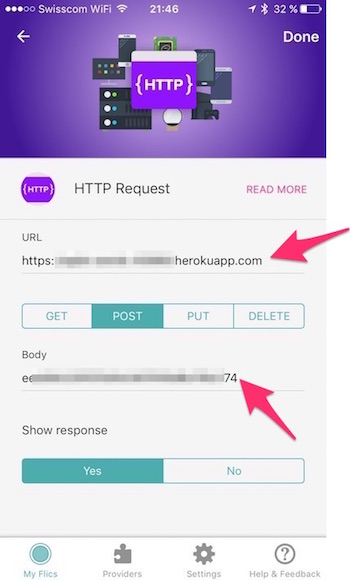

# flictoggl
*Track time on [Toggl](https://www.toggl.com) using a [Flic](https://flic.io/) button.*

`flictoggl` connects a [Flic](https://flic.io/) smart button to your [Toggl](https://www.toggl.com) account for simple *on/off* time tracking. Hit the button to start recording time. Hit it again to stop. Simple as pie.

## Requirements
* NodeJS

---

## Use with Flic Mobile App
You have to deploy `flictoggl` as an HTTP service in order to use it with the Flic mobile app.

### Step 1: Deploy to Heroku
*You can deploy `flictoggl` everywhere you want. This guide shows how you can do this using [Heroku](https://heroku.com) though.*

```bash
git clone https://github.com/swissmanu/flictoggl.git
cd flictoggl
heroku create
git push heroku master
```

Make sure you note down the URL of the deployed Heroku app for later use in step 3.

### Step 2: Configure Flic App
* Open the Flic app on your phone
* Add an `HTTP Request` action
* Enter the URL of the deployed Heroku app from step 1
* Select `POST` as request type
* Paste the API token from step 2 to the `Body` field




### Step 3: Test drive!
* Press your Flic button once for start recording time
* Press the button again to stop recording
* Check the Toggl web timer

---

## Use with `hax-with-flic`
[hax-with-flic](https://github.com/50ButtonsEach/hax-with-flic-osx) runs executable scripts on your Mac upon pressing a connected Flic button.
To attach `flictoggl` to `hax-with-flic`, install `flictoggl` as command line utility:

```bash
npm install -g flictoggl
```

You have to create a wrapper script around `flictoggl` to run it with `hax-with-flic-osx`. Example:

```bash
#!/bin/sh

# hax-with-flic is on a very early stage currently.
# Make sure the PATH env var contains the path to your NodeJS installation.
# flictoggl will not work otherwise.
export PATH=/path/to/node/js:$PATH
RESULT=`flictoggl [TogglAPIToken]`

# Uncomment for Goodie: Show Started/Stopped via OS X notification center:
# osascript -e "display notification \"$RESULT\" with title \"Toggl\""
```

Hook the script to `hax-with-flic`:


---

## How to get your Toggl API Token
* Login to your [Toggl account](https://www.toggl.com/app/profile)
* Go to your profile
* Copy your API token from the very bottom of the page
